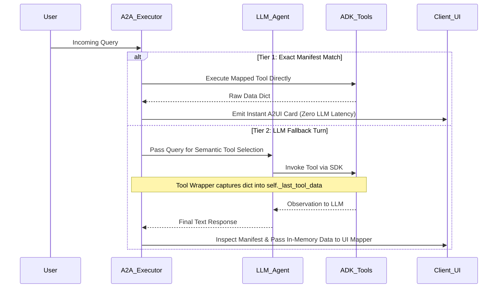

# Aon HR Agent

This repository serves as a customized instance of the Gemini Enterprise (GE) agent template, tailored for the **Aon** HR use case. It leverages the **A2UI (Agent-to-Agent User Interface)** engine to demonstrate secure, AI-driven HR self-service and performance review synthesis, simulating integration with Workday.

It's an A2UI-enabled ADK agent that can be deployed to Cloud Run and integrated into Gemini Enterprise.

Given that deployment takes 10+ minutes, we use `adk-web-react` to test locally before deploying.

---

## Architecture

For a detailed breakdown of the architecture and design patterns, please refer to [architecture.md](file:///Users/rtejada/Workspace/aon-hr-agent/architecture.md).

The project uses a custom executor, `AdkAgentToA2AExecutor` (found in `backend/agent_executor.py`), to bridge the ADK agent with the A2UI rendering engine.

### The Execution Flow
The system operates a dual-tier orchestration architecture managed by `AdkAgentToA2AExecutor` (found in `backend/agent_executor.py`) in conjunction with `demo_manifest.json`:



1. **Tier 1 (Fast-Path Interception)**: When an incoming query exactly matches a manifest trigger substring (ignoring punctuation), the server bypasses the LLM, executes the mapped ADK tool synchronously, and instantly emits the designated UI card.
2. **Tier 2 (In-Memory Data Capture on LLM Fallback)**: When a query misses manifest triggers, it proceeds to the LLM for semantic tool selection. All ADK tools are wrapped at initialization; as any tool executes during the LLM turn, its raw data dictionary is captured directly into backend memory (`self._last_tool_data`). During payload packaging, the server matches the active tool against the manifest and passes the captured data directly to the designated UI mapper, guaranteeing flawless, zero-overhead UI hydration.

### Active Templates Mapping
| Template Name | Description | Active Tools |
| :--- | :--- | :--- |
| `workday_portal` | The custom high-fidelity Workday shell supporting D3 and Radar charts | `get_hr_portal_overview()`, `get_performance_reviews()` |
| `universal_dashboard` | The secure, branded container for general widgets | General fallback or custom views |

### ⚡ Deterministic UI Advantage
To eliminate LLM hallucination and trailing comma syntax errors, the `AdkAgentToA2AExecutor` intercepts backend Python tool responses directly. If a tool returns an A2UI list or a CustomView dictionary, the system bypasses the LLM's character-by-character text reproduction. It automatically injects valid, schema-adhering JSON payloads as native `DataPart` objects with mimeType `application/json+a2ui`.

### 🛠️ Local Development Fallbacks
To support iterating without touching production Cloud Run settings or running into locked Google Cloud Storage bucket permission errors, the backend respects a strict environment check:
* If the environment variable `K_SERVICE` is absent, media endpoints automatically write generated assets directly to a local directory (`backend/data/media_cache/`) instead of GCS.
* Mock data is read from local JSON files in `backend/data/` to simulate external systems like Workday.

### 📤 Asset Staging (`upload_logos.py`)
To ensure images and logos are accessible by Gemini Enterprise, use the provided script to stage local assets in GCS:
```bash
python3 backend/upload_logos.py
```
This script uploads files from `backend/data/logos/` to the project's media cache bucket. This serves as a reusable pattern for any project requiring GCS asset staging.

---

## Project Structure

-   `backend/templates/workday_portal.html`: The custom high-fidelity Workday shell supporting D3 and Radar charts.
-   `backend/agent.py`: System instructions and tool routing (HR Persona).
-   `backend/hr_data.py`: Data generators and state management mocking Workday data.
-   `backend/component_library.py` & `component_mappers.py`: Native A2UI component generators and pure data mappers.

---

## Getting Started

### 1. Run Locally
```bash
cd backend
python3 main.py
```
Then use `adk-web-react` to connect to `http://127.0.0.1:8080`.

### 2. Deploy to Cloud Run
```bash
cd backend
./deploy.sh <YOUR_PROJECT_ID> <SERVICE_NAME>
```

---

## A2UI Widget Specifications Used

### D3 Relationship Graph (Org Chart)
Visualize complex node-edge connectivity. Used to show the security boundary in the HR portal.
- **Data Type**: `d3-network`
- **Fields**: `id`, `label`, `color`, `radius`.

### Vega Chart (Performance Trends)
Native declarative animated visualizations.
- **Data Type**: `VegaChart`
- **Spec**: Vega-Lite JSON specification.

---

## HR Agent Demo Queries

Use these queries to run the demo flow:

1. how many vacation days do I have left?

2. let's look at my HR portal

3. Enroll me in the Commuter Benefit

4. help me prepare for Bob's performance review

5. generate a team skill matrix graphic

---

## Unexplored A2UI Standard Capabilities

These standard components are available in the schema (`a2ui_schema_full.py`) and work out-of-the-box without needing custom HTML templates:

* **`Tabs`**: Organize complex dashboards into multiple logical views.
* **`Modals`**: Bind popups to buttons to show rich contextual overlays.
* **`TextFields`**: Supports date, number, and secured inputs.
* **`Sliders`**: Perfect for numerical range tuning.
* **`DateTimeInput`**: Native date/time picker.
