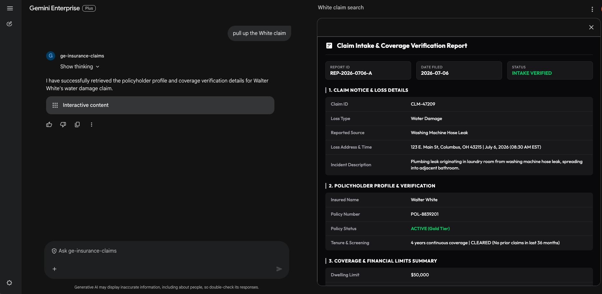
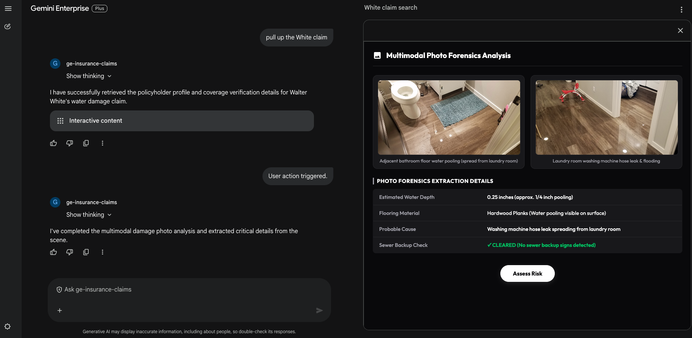
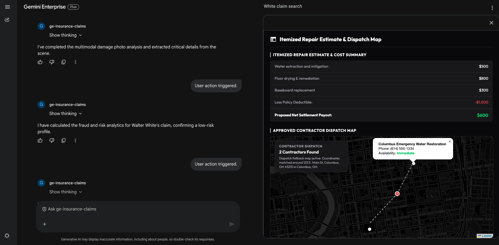

# Gemini Enterprise Insurance Claims Assistant Agent

Gemini Enterprise Insurance Claims Assistant is an A2A (Agent-to-Agent) agent designed to work with **Gemini Enterprise** to automate claims triage, damage verification, risk analysis, contractor mapping, and settlement workflows.

It implements the entire claims handler experience through a series of five structured interactive reports rendered inside Gemini Enterprise's wide side panel (`"canvas-surface"`).

---

## Key Beats & Features

1. **Policy Verification & Triage (Beat 1):** Automates the review of coverage limits, policy status, and exclusions based on the specific First Notice of Loss (FNOL) inputs.

   

2. **Damage Visual Forensics (Beat 2):** Extracts key damage indicators from uploaded photos (e.g. water depth extraction, flooring materials) using Gemini Multimodal reasoning.

   

3. **Risk & Fraud Assessment (Beat 3):** Performs historical audit checks (tenure, loyalty tier, and prior claim frequency) to generate a verified fraud risk score.

4. **Itemized Estimate & Contractor Map (Beat 4):** Itemizes repair costs, deductibles, and net settlement payouts alongside an interactive dark map pinpointing the closest available local emergency responders.

   

5. **Regulatory Settlement Letter & Dispatch Booking (Beat 5):** Outlines a formal regulatory approval letter complying with Ohio state regulations and provides an interactive appointment scheduler to dispatch emergency water restoration.

---

## Tech Stack & Architecture

* **Backend:** Python + FastAPI / WSGI server.
* **UI Renderer:** Agent-to-UI (A2UI) protocol.
* **Frontend Panels:** Full-height scrollable HTML frames (`WebFrameSrcdoc`) styled in a luxury dark monochrome palette matching Gemini Enterprise UI standards.
* **Geospatial Services:** Leaflet and Google Maps API for contractor dispatch routing.

---

## Environment Variables

Ensure the following variables are configured in your environment or local `.env` file (not committed to git):

| Variable | Description | Example |
| :--- | :--- | :--- |
| `GEMINI_MODEL` | Mandatory LLM deployment target (defaults to `gemini-3.5-flash`). | `gemini-3.5-flash` |
| `GOOGLE_MAPS_API_KEY` | Key used to authorize and render Google Maps. | `AIzaSy...` |
| `AGENT_URL` | The public endpoint of your deployed service. | `https://ge-insurance-claims-...` |

---

## Deployment & Setup

### 1. Local Run
To run the server locally:
```bash
python3 backend/agent.py
```

### 2. Deploy to Cloud Run
To build and deploy the container to GCP Cloud Run, ensure your GCP SDK is configured and run:
```bash
./backend/deploy.sh
```

---

## Registering the Agent in Gemini Enterprise

Once the agent is running locally or deployed to Cloud Run, you can register it in Gemini Enterprise:

1. **Configure the Agent Card:**
   * Open `agent_card.json` at the root of the project.
   * Replace the `"url"` placeholder `"https://YOUR_CLOUD_RUN_URL_HERE"` with the public HTTPS URL of your deployed Cloud Run service.
2. **Register the Extension:**
   * Open the Gemini Enterprise developer console or extensions panel.
   * Click **Add Extension / Custom Agent**.
   * Upload or paste the contents of your configured `agent_card.json`.
3. **Trigger the Flow:**
   * Start a new chat session in Gemini Enterprise.
   * Trigger the agent by typing the following query:
     > *check the new water damage claim for Walter White*

---

## Security & Exclusions

* **Git Exclusion:** A robust `.gitignore` prevents logs, local virtual environments, and `.env` credentials from being committed.
* **Secure Auth:** No hardcoded API keys exist in the codebase. All sensitive API keys are parsed securely from GCP Cloud Run environment settings at runtime.

---

> [!NOTE]
> **NB: A2UI Canvas Rendering Workaround**
> Due to Google Cloud Console's sandbox security settings, the Gemini Enterprise console restricts custom elements from loading third-party content and disables rendering of iframe canvas cards by default.
> 
> To enable rendering of the interactive reports (canvas UI frames), you can use a **Bookmarklet** to override this restriction:
> 
> 1. Show your browser's Bookmarks Bar (`Cmd + Shift + B` on macOS).
> 2. Right-click the bookmarks bar and select **Add Page** (or **Add Bookmark**).
> 3. Name the bookmark: `Enable A2UI Canvas`
> 4. Set the **URL** (or Location) to:
>    ```javascript
>    javascript:(function(){const%20el=['ucs-a2ui','a2ui-web-frame-srcdoc','a2ui-web-frame-url'];el.forEach(t=>{const%20c=customElements.get(t);if(c&&c.prototype){Object.defineProperty(c.prototype,'iframeEnabled',{get:function(){return%20true;},set:function(){},configurable:true});}});console.log('✓%20A2UI%20Canvas%20Enabled');})()
>    ```
> 5. **Usage:** You must click the **`Enable A2UI Canvas`** bookmark on the **Gemini Enterprise landing page *before*** triggering or clicking on the agent. Clicking the bookmarklet pre-emptively overrides the rendering restrictions so the canvas loads properly when the agent starts.
