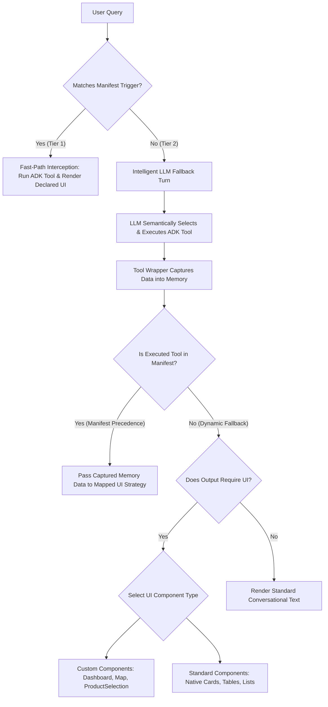

# ADK Agent Architecture

## 1. Context & Architecture

### Overview
This agent is built using the **Agent Development Kit (ADK)** and is designed to be **A2UI-enabled**. It is deployed as a containerized service on **Google Cloud Run** and integrated into **Gemini Enterprise (GE)** via the **A2A (Agent-to-Agent)** protocol. This integration provides the rich "agent card" experience in the GE interface.

### Constraints & Environment
*   **A2UI 0.8 Compatibility**: The deployed environment in GE strictly requires compliance with **A2UI schema version 0.8**. All rich UI components (DataGrids, Charts, Maps, Forms) must conform to this specific version's schema.
*   **Reference Libraries**: While local copies of `adk-python`, `a2a`, and `a2ui` may be available in the workspace, they serve as references. The actual agent implementations may vary to accommodate specific demo requirements and the A2UI 0.8 constraint.

---

## 2. Current Approach: Decoupled Data & Declarative UI

To address the complexity of building and cloning these agents, we use a design that **decouples data from presentation** and uses a **declarative manifest** to control the execution flow and UI rendering.

### 1. "Pure Data" Tools
Tools are strictly focused on fetching and returning business facts (raw data). They do not construct UI component trees or reference templates. This isolates the impact of data schema changes and makes tools reusable.

### 2. Component Library & Mappers
For scenarios where a low-overhead, native experience is preferred, we use a **Component Library** (`component_library.py`) to generate Native A2UI JSON payloads safely and consistently. Specialized **Mapper Functions** take the pure data from tools and use the library to build the specific card structure.

### 3. Declarative Demo Manifest
The `demo_manifest.json` file acts as the orchestration layer. It maps specific user queries to tools and defines the rendering strategy without hardcoding Python logic.

### 4. Stateless 5-Step Execution Engine (Jaccard Stem Engine)
To guarantee 100% reliable UI and data rendering across exact demo scripts and unmapped follow-up conversational turns without relying on stateful session trackers or single-word keyword bandaids, `agent_executor.py` operates a completely stateless 5-step execution chain:
1. **Stateless Manifest Interception (Tier 1)**: Incoming queries are evaluated via exact substring or regular expression token stem matching (`_handle_intercepted_action`). If all word stems match (e.g., `vacation`, `day`, `left`), the server synchronously executes the mapped ADK tool in Python and instantly emits the UI card. Zero LLM latency.
2. **Stateless LLM Fallback & Memory Capture (Tier 2)**: When a query misses manifest triggers, the turn passes to the ADK LLM agent. To eliminate chat stream JSON echoing truncation, all registered ADK tools are dynamically wrapped. Whenever any tool executes during the LLM turn, the wrapper captures the exact returned data dictionary directly in backend server memory (`self._executed_tool_data`) and locks `self._executed_tool_name`. During payload packaging, the server inspects the active tool against the manifest and passes the captured memory dictionary directly into the UI mapper (`native` or `iframe`), guaranteeing flawless UI hydration.
3. **Stateless Semantic Jaccard Topic Matching (Tier 3)**: When the user asks follow-up variations (*"vacations day left?"*) and the ADK LLM agent answers directly from its conversational memory without calling any tool (`active_tool` is `None`), the server executes a stateless Jaccard set similarity match. It strips conversational stop words (`{'how', 'many', 'have', 'the', 'for', 'let', 'look', 'show', 'give'}`) and evaluates set intersection between incoming text stems and each manifest step. If the Jaccard overlap score >= 1, it sets the mapped topic (e.g., `get_benefits_summary`). Because our pure data tools are side-effect-free read operations against static JSON files, the server synchronously executes the tool in Python (<1ms) to retrieve `active_data` and deterministically renders the manifest UI (`build_benefits_card`)!
4. **Stateless Resolution for Unmapped Turns (Tier 4 & 5)**: If the query misses all manifest topics entirely (*"Tell me a joke"*), `manifest_handled` remains `False`. The server naturally evaluates whether the LLM outputted a `CustomView` dashboard (`find_custom_view`). If found, it mounts the dashboard. If not, it renders standard conversational text.

## 2.5 Declarative UI Philosophy & Cascading Decision Tree

### The Declarative Philosophy
The fundamental philosophy of this architecture is that **backend execution logic must remain completely decoupled from presentation formatting**. Backend server code and LLM agent instructions should focus strictly on business data fetching and semantic reasoning. By declaring UI strategies in a standalone manifest (`demo_manifest.json`) and component mappers, we prevent backend code from turning into fragile HTML/JSON markup spaghetti, allowing seamless multi-tenant and industry cloning.

### The Cascading Decision Tree
When a user query arrives, the execution engine processes it through a strict cascading decision tree:



### UI Component Selection & Formatting Guidance
When designing or adapting mappers and templates for new industry clones, adhere to the following decision criteria:

#### 1. When to Use Custom Components
*   **`ProductSelection`**: Use exclusively for interactive, editable tabular workflows requiring picklist selections, numerical pricing inputs, and action buttons (e.g., license configuration, plan enrollment).
*   **`DataGrid`**: Use for high-density, read-only tabular datasets where column sorting, filtering, and pagination are essential.
*   **`WebFrameSrcdoc` (Dashboard / Custom HTML)**: Use for multi-metric executive views combining charts, KPI grids, or advanced visual simulations. It sandboxes custom HTML/JS and enforces strict CSP headers (`connect-src 'none'`).
*   **`WebFrameUrl`**: Use when embedding an external allowlisted web page directly (e.g., standard Google Maps embed, public document viewer) where cross-origin JavaScript communication is not required.

#### 2. When to Use Standard Native Components
*   **`Card`, `Column`, `Row`, `Text`, `Icon`, `Divider`, `List`**: Use for low-overhead, lightning-fast Native A2UI widgets that blend perfectly into the Gemini Enterprise chat canvas.
*   **Styling & Layout Best Practices**:
    *   *Contact / Profile Card*: Use a top `Row` with an `avatar` or `person` icon alongside the individual's name formatted in `h2`. Follow with a `Divider` and key-value `Row` items formatted in `body` text.
    *   *Account / Financial Summary*: Use a `Card` structuring KPI metric boxes in `Column` containers using large typography (`h1` or `h2` for numerical values) paired with muted `caption` labels underneath.

#### 3. Sequential Multi-Component Rendering
The declarative architecture supports emitting an array of multiple sequential A2UI messages within a single execution turn. For interactive confirmation workflows, mapper functions can output a sequential list:
```python
[
    cl.begin_rendering(surface_id="canvas-surface", root="card-id"),
    cl.surface_update(surface_id="canvas-surface", components=card_components),
    cl.surface_update(surface_id="canvas-surface", components=confirmation_button_components)
]
```
This allows complex multi-step visual components (e.g., a summary card followed immediately by an enrollment confirmation button) to render elegantly one after the other inside the same chat canvas slot.

## 3. Manifest Flexibility & Capabilities

The `demo_manifest.json` is highly flexible and supports the following options for each step:

*   **`trigger_queries`**: A list of strings to match against the user's input. The matching is a **simple substring check** (case-insensitive). It does not use regex or semantic matching.
*   **`output_mode`**:
    *   `"native"`: Renders low-overhead Native A2UI components (Cards, Tables, Text, ProductSelection) using mapper functions.
    *   `"iframe"`: Renders a rich custom dashboard inside a `WebFrameSrcdoc` using an HTML template.
    *   `"url"`: Renders an external allowlisted web URL directly in a `WebFrameUrl` (e.g. Google Maps embed).
    *   `"text"`: Bypasses UI generation and returns only text.
*   **`theme`** *(Optional)*: String indicating styling mode (e.g., `"light"`, `"dark"`). If omitted, templates gracefully fall back to default styling.
*   **`config`** *(Optional)*: A dictionary of bespoke styling or behavior parameters (e.g., `{"border": "none", "header_color": "#ef4444", "enableHeatmap": true}`). If omitted, templates default to clean, borderless bounds.

### Default Behavior
If a user query does not match any `trigger_queries` in the manifest, the system **defaults to running the LLM agent normally**. The LLM will then decide to call tools or generate a text response based on its system instructions.

### Note on Phases and Demo Flexibility
The `phase` field in `demo_manifest.json` is strictly **descriptive** and is **not enforced** by the executor. This allows the presenter to change the sequence of queries or repeat queries during a live demo without getting blocked by strict state transitions.

### Component Taxonomy: Standard vs. Custom
In Gemini Enterprise (A2UI 0.8), UI capabilities are strictly organized into two architectural layers:

#### 1. Standard Components (Core A2UI 0.8 Specification)
These native elements work out of the box with zero external template overhead. They are fully supported in `component_library.py`:
*   **Structural**: `Column`, `Row`, `Card`, `Divider`, `Surface`, `Root`, `UI`, `Styles`
*   **Content & Media**: `Text`, `Icon`, `Image`, `Video`, `AudioPlayer`
*   **Navigation & Overlays**: `List`, `Tabs`, `Modal`
*   **Input & Controls**: `Button`, `TextField`, `CheckBox`, `Slider`, `MultipleChoice`, `DateTimeInput`

#### 2. Custom Components (Specialized Extensions)
These are advanced domain-specific web components or sandboxed containers:
*   **`WebFrame` (`WebFrameSrcdoc` & `WebFrameUrl`)**:
    *   `WebFrameSrcdoc`: Renders sandboxed custom HTML/JS strings (like our `universal_dashboard` or `base_map` templates). It strictly enforces a CSP header (`connect-src 'none'`).
    *   `WebFrameUrl`: Renders allowlisted external URLs directly in an iframe (like Google Maps or YouTube embeds).
*   **`ProductSelection`**: A native custom component that renders editable tables with picklists and numerical validation.
*   **`DataGrid`**: High-performance tabular data viewer.
*   **`VegaChart`**: Declarative animated visual charts.
*   **`GeSduiViewer`**: Server-driven UI viewer. *(Note: In A2UI 0.8, this component is currently disabled/stubbed in the frontend code pending dynamic import support in Gemini Enterprise).*

### Advanced Visual Demos (Geographic Maps & Multi-Layer Overlays)
For complex geographic visualizations, the agent pairs `WebFrameSrcdoc` with the specialized `base_map.html` Leaflet pack. This architecture decouples backend routing calculations from client-side vector rendering:
* **Backend Google Maps SDK (`route_tools.py` / `map_services.py`)**: Computes accurate driving directions, polyline coordinates, distances, and durations via Google Maps APIs before rendering.
* **Client-Side Leaflet Overlays (`base_map.html`)**: Dynamically hydrates multi-layer interactive maps supporting:
  - **Density Heatmaps**: Configurable radius and blur (`L.heatLayer`) for hotspot clustering.
  - **Clickable & Hoverable Markers**: Custom HTML tooltips (`bindTooltip`) supporting rich metadata popups.
  - **Pulsing Marker Rings**: Pure CSS animated radar rings (`.pulse-ring`) whose scale, animation velocity, and alert colors (`#facc15` yellow, `#f97316` orange, `#ef4444` red) scale dynamically with priority or severity scores.
  - **Animated Polyline Routes**: Dashed trajectory lines (`dashArray: '10, 10'`) illustrating supply chain or logistics paths.
  - **Layer & API Toggles**: Built-in UI controls (`#layerToggles`) enabling users to toggle heatmaps or activate live API overlays (e.g., OpenWeatherMap raster tile layers or traffic density layers).

For simple static maps or direct embeds without custom overlays, the agent can use `WebFrameUrl` pointing directly to Google Maps.

### Note on Templates
*   `universal_dashboard.html`: The secure, branded version for common components (Table, Chart, Image).
*   `dashboard.html`: Legacy template with advanced components (Vega, Simulator) but less strict security guards.
*   `base_map.html`: Specialized for map visualizations.

## 4. Supported Component Data Schemas

When returning pure data from tools to be rendered in `universal_dashboard.html`, follow these JSON structures for the `grid` array items:

### 1. Table
*   **`type`**: `"table"`
*   **`data`**:
    ```json
    {
      "headers": ["Header 1", "Header 2"],
      "rows": [
        ["Row 1 Col 1", "Row 1 Col 2"],
        ["Row 2 Col 1", "Row 2 Col 2"]
      ]
    }
    ```

### 2. Chart
*   **`type`**: `"chart"`
*   **`data`**:
    ```json
    {
      "type": "bar", 
      "labels": ["Jan", "Feb", "Mar"],
      "data": [10, 20, 30],
      "label": "Monthly Sales"
    }
    ```

### 3. Image
*   **`type`**: `"image"`
*   **`data`**: `"https://url-to-image.png"` OR `{"src": "...", "alt": "..."}`

### 4. Map (High-Fidelity Geo-Visualization)
When returning data from tools to be rendered in `base_map.html` or `universal_dashboard.html`, structure the JSON payload as follows to unlock full visual capabilities:
*   **`type`**: `"map-composite"` (or `"map-heatmap"`)
*   **`data`**:
    ```json
    {
      "zoom": 12,
      "center": [42.3601, -71.0589],
      "theme": "dark",
      "config": {
        "enableHeatmap": true,
        "enableWeatherStub": true
      },
      "heatmap_points": [
        [42.3601, -71.0589, 0.9],
        [42.3584, -71.0597, 0.6]
      ],
      "markers": [
        [42.3601, -71.0589, 0.95, "Boston Global HQ", "Active Normal"],
        [42.3584, -71.0597, 0.45, "Distribution Hub 4", "High Volume"]
      ],
      "routes": {
        "optimal_route": {
          "coordinates": [[42.3601, -71.0589], [42.3584, -71.0597]],
          "distance": "3.2 miles",
          "duration": "12 mins"
        }
      }
    }
    ```

### 5. Simulator
*   **`type`**: `"simulator"`
*   **`data`**:
    ```json
    {
      "controls": [
        {"label": "Variable 1", "min": 0, "max": 100, "value": 50, "step": 1}
      ],
      "chartConfig": { },
      "onUpdateBody": "function body string..."
    }
    ```

### 6. Product Selection Table (Native Web Component)
*   **`type`**: `"product-selection"`
*   **`data`**:
    ```json
    {
      "columns": [
        {"key": "name", "label": "Product", "type": "string"},
        {"key": "category", "label": "Category", "type": "picklist", "editable": true, "options": ["Basic", "Premium", "Enterprise"]},
        {"key": "price", "label": "Price ($)", "type": "number", "editable": true}
      ],
      "rows": [
        {"name": "HR Platform License", "category": "Premium", "price": 5000}
      ],
      "title": "Included Products",
      "confirm_label": "Save",
      "cancel_label": "Reset"
    }
    ```

---

## 5. Multi-Step Cloning Protocol

When cloning this repository for a new customer, industry, or use case (e.g., clinical trials, retail inventory, wealth management), avoid making haphazard single-turn changes. Follow this rigorous 5-step cloning protocol:

### Step 1: Narrative & Schema Design (Alignment Phase)
1.  Define the target customer, industry persona, and key pain points.
2.  Map out exactly 4-5 steps for the core demo flow in a spreadsheet or document (User Query -> Action Tool -> Target Output Mode: `native`, `iframe`, `url`, `text`).
3.  Define the exact JSON data schemas required for each tool's business response.
4.  *CRITICAL: Stop and verify alignment with stakeholders before writing any code.*

### Step 2: Synthetic Data & Core Domain Tools
1.  Create detailed, high-fidelity mock data JSON files inside `backend/data/` (e.g., `wealth_portfolio.json`) matching the agreed schema.
2.  Create a dedicated domain data Python module (e.g., `wealth_data.py`) containing pure data tools that read/write to those JSON files. Ensure all tools return clean Python dictionaries (zero HTML/UI formatting).
3.  Register these new tool functions in `agent.py` and update `SYSTEM_INSTRUCTION` to reflect the new domain persona.

### Step 3: Component Library Mappers
1.  In `component_mappers.py`, create specialized Python mapper functions (e.g., `build_portfolio_card(data)`) that translate pure domain dictionaries into Native A2UI component lists using generator functions from `component_library.py`.
2.  For custom dashboard layouts or interactive simulators, create or adapt HTML templates inside `backend/templates/` (e.g., `wealth_dashboard.html`).

### Step 4: Declarative Orchestration (`demo_manifest.json`)
1.  Completely update `demo_manifest.json` with the new demo steps.
2.  For each step, define clean, natural sample trigger sentences in `trigger_queries` (e.g., `"how many vacation days do I have left?"`). Avoid adding single-word keyword crutches (like `"vacation"`).
3.  *Note: The stateless Jaccard stem engine in `agent_executor.py` will automatically evaluate stem overlap across all follow-up conversational variations, ensuring flawless topic switching without requiring stateful tracking.*

### Step 5: Meta-Files, Branding & Verification
1.  Stage new logos or visual assets in `backend/data/logos/` and run `python3 backend/upload_logos.py` to cache them in GCS.
2.  Update `agent_card.json` with the new agent name, description, and sample queries.
3.  Update `deploy.sh` with the new Cloud Run service name and required environment variables.
4.  Update `README.md` with the new demo script.
5.  Execute `python3 -m unittest discover tests` to verify local stability before running `./deploy.sh`.
