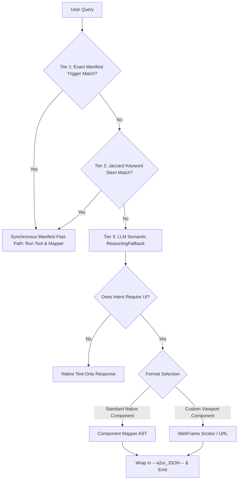

# ADK Agent Architecture: A2UI Seed Agent

## 1. Context & Rebranded Architecture

### Overview
This agent is a customer-agnostic, dark-themed, production-grade **A2UI Seed Agent** (`a2ui_seed_agent`). It is built using the **Agent Development Kit (ADK)**, is **A2UI-enabled**, and is designed to showcase the full spectrum of Gemini Enterprise user interface capabilities. It deploys natively to **Google Cloud Run** under a secure, least-privileged service identity and integrates via the **A2A (Agent-to-Agent)** protocol to provide rich visual interactive "agent card" experiences in the Gemini Enterprise chat space.

### Environment & Specifications
*   **A2UI 0.8 Compatibility**: Fully compliant with the **A2UI schema version 0.8**.
*   ** central styling**: Curated charcoal (`#0f172a`), slate (`#1e293b`), and electric blue (`#38bdf8`) palette.

---

## 2. Execution Pipeline (Cascading Decision Tree)

To guarantee 100% reliable UI rendering across exact demo scripts as well as dynamic conversational queries without stateful session tracking, `agent_executor.py` operates a multi-tiered execution logic flow:

### 1. Tier 1: Exact Manifest Trigger Match
Punctuation-cleaned user queries are compared against exact triggers in `demo_manifest.json`. If an exact match is found, the query is intercepted immediately to call the associated tool.

### 2. Tier 2: Jaccard Keyword Stem Matching
If exact match fails and the step has `"fuzzy_matching": true` enabled, set similarity Jaccard set evaluations are conducted. It filters conversational stop words (`{"let", "show", "give", "how", "many"}`), extracts tokens, and computes intersection sizes. If overlap threshold is met, the query is intercepted synchronously.

### 3. Tier 3: LLM Semantic Fallback (Gemini)
If no manifest triggers match (or `"fuzzy_matching": false` is set), the query flows semantically to Gemini. The LLM parses context and determines tool executions.
*Note on Freestyle Ad-Hoc Widgets:* Dynamic ad-hoc component generators (`ui_generators.py` tools like `render_ui_dropdown`, `render_ui_checkbox`) are fully registered, allowing users to ask freestyle visual widgets in addition to the manifest-driven phases.

### 4. Tier 4: UI Decision & AST Formatting
*   **No UI Required:** Conversational text response is returned directly.
*   **UI Required:** The system outputs standard components constructed in `component_mappers.py` or custom viewports in `templates/` wrapped cleanly behind the `---a2ui_JSON---` delimiter.

---

## 3. Implemented Showcase Capabilities

### A. Pre-Wired Standard Components Showcase (`get_standard_widgets_overview`)
Loads decoupled mock widget specifications from `showcase_widgets.json` and passes them to `build_showcase_widgets_card(data)` to generate:
*   **`Tabs`**: Separates interactive dashboards into Form Inputs, Choices, and Modals.
*   **`Modal`**: Launches popups displaying detailed body info bound to button triggers.
*   **`TextField` & `Slider`**: Captures user references and scales bound to reactive selection paths (e.g., `{"path": "/tf_state"}`).
*   **`CheckBox` & `MultipleChoice`**: Renders picklist selectors. Picklists are limited to `maxAllowedSelections: 1`, selection paths bind to `/dropdown_state`, and options specify literal `value` equal to the text string.

### B. Advanced Geographic Maps (`get_map_visualization`)
Supports two distinct mapping paths resolved dynamically based on query intent:
1.  **Standard URL Map (`WebFrameUrl`)**: Embeds standard, allowlisted key-free Google Maps iframe place search views.
2.  **High-Fidelity Map Overlays (`WebFrameSrcdoc` using `base_map.html`)**: Custom Leaflet maps incorporating:
    *   *Demand Heatmaps*: CSS-recalculated density hotspots.
    *   *CSS Pulsing Radar Markers (`.pulse-ring`)*: Priority pins changing scale colors (yellow, orange, red) dynamically.
    *   *OpenStreetMap GPS Traffic Flow*: Completely key-free, live transparent road congestion lines.
    *   *Live OWM Clouds & Wind velocity*: Pronounced, high-contrast real-time weather clouds and wind contour overlays.
    *   *Local Restaurants & Shops POIs*: Points of Interest pulled dynamically from the OpenStreetMap **Overpass API** complete with emerald, amber, and indigo custom pin tooltips!
    *   *Stretching Radar tiles*: Capping composite zooms at `maxNativeZoom: 6` to auto-stretch imagery and permanently prevent any CDN zoom watermarks.
    *   *Default-Off Interactive Overlays*: All dynamic overlays (weather, traffic, heatmaps, pulsing alert rings, POIs) are disabled by default on startup. Users toggle them via checkboxes in the overlay control panel.

### C. Decoupled Visual Analytics Dashboards
Provides two completely segregated custom viewports inside the step manifest to showcase multi-template capability:
1.  **Universal Dashboard (`universal_dashboard.html`)**: Standard analytics metrics featuring bold counter cards, simulated Risk vs. Attainment sliders, and allocation trends.
2.  **D3 Directed Network Graph (`dashboard.html`)**: Interactive drag/zoom directed org nodes representing peer connections, severity pulsing anchors, and connection metadata tables.

### D. Interactive Kanban & POS Checkout Templates
1.  **Aesthetic Kanban Board (`kanban_board.html`)**: A custom viewport showcasing dynamic project backlog tracking. Features columns (TODO, IN PROGRESS, DONE), story points, assignee badges, detailed task description modal popups, interactive comments additions, and status transitions syncable to the parent agent frame.
2.  **Checkout & Refund Register (`pos_register.html`)**: Renders transaction receipt components, items cart, subtotals, loyalty tier recommendations, and dynamic complete stamp overlays ("REFUND APPROVED", "EXCHANGED") that animate upon action dispatch.

### E. Seekable TTS WAV Transcoding & Syn Image Caching
*   **WAV Transcoding**: `generate_audio_summary` queries `gemini-3.1-flash-tts-preview` for a **150-word spoken briefing** (~45s). It intercepts raw `audio/l16` PCM bytes and prepends a standard **44-byte RIFF/WAV header** in Python before saving, rendering files natively seekable.
*   **Custom Voice Profile:** Resolves voice and speaker setups from `demo_manifest.json` (supporting `"mode": "single"` and `"mode": "podcast"` multi-speaker dialogue).
*   **Image Generation**: Multimodal synthetic images are generated via `gemini-3.1-flash-image-preview` and cached to GCS or local directories.

### F. Vertex AI Veo 2.0 Video Generation (`generate_walkthrough_video`)
*   **High-End AI Video Generation**: The `generate_walkthrough_video` tool connects to the `google-genai` SDK using `veo-2.0-generate-001` to generate a 4-second walkthrough video clip (16:9 aspect ratio) based on user prompt descriptions (optionally attaching/uploading starter images).
*   **Production Caching**: Automatically saves and caches generated videos to GCS (when running on Cloud Run) or a local media cache directory, falling back to a pre-defined generic walkthrough asset if Vertex credentials/services are unavailable.

---

## 4. Session Data Persistence & Rehydration

To track active parameters securely during multi-agent or conversational turns:
1.  **Session Isolation:** User selections, textfields, and checkbox states are written locally to `/public/data/[session_id]_widget_state.json`.
2.  **Rehydration Action triggers:**
    *   `save_widget_selection`: Triggered when clicking "Save Active Selection", writing active states immediately to the local directory.
    *   `load_widget_selection`: Triggered when clicking "Load Last Run", reading state and automatically rehydrating active inputs.

---

## 5. Google Cloud IAM Service Account Strategy

To prevent raw API key invalidation or leakage:
*   **Dedicated Run Identity:** Attached service account `a2ui-seed-run-identity@YOUR_GCP_PROJECT_ID.iam.gserviceaccount.com` is configured in `deploy.sh` via `--service-account`.
*   **Least Privilege Roles:**
    *   `roles/aiplatform.user` (Vertex AI User): Grants access to run generative Vertex models.
    *   `roles/storage.objectAdmin` (Storage Object Admin): Limits GCS read/write permissions to caching dynamic visual assets in `YOUR_GCP_PROJECT_ID-a2ui-media-cache`.
*   **Local Development ADC:** Authorized securely via `gcloud auth application-default login`, eliminating local JSON secret keys distribution.

---

## 6. Multi-Step Cloning Protocol

When cloning this repository for a new customer, industry, or use case (e.g., clinical trials, retail inventory, wealth management), avoid making haphazard single-turn changes. Follow this rigorous 5-step cloning protocol:

### Step 1: Narrative & Schema Design (Alignment Phase)
1. Define the target customer, industry persona, and key pain points.
2. Map out exactly 4-5 steps for the core demo flow in a spreadsheet or document (`User Query` -> `Action Tool` -> `Target Output Mode`: `native`, `iframe`, `url`, `text`).
3. Define the exact JSON data schemas required for each tool's business response.
4. *CRITICAL: Stop and verify alignment with stakeholders before writing any code.*

### Step 2: Synthetic Data & Core Domain Tools
1. Create detailed, high-fidelity mock data JSON files inside `backend/data/` (e.g., `wealth_portfolio.json`) matching the agreed schema.
2. Create a dedicated domain data Python module (e.g., `wealth_data.py`) containing pure data tools that read/write to those JSON files. Ensure all tools return clean Python dictionaries (zero HTML/UI formatting).
3. Register these new tool functions in `agent.py` and update `SYSTEM_INSTRUCTION` to reflect the new domain persona.

### Step 3: Component Library Mappers
1. In `component_mappers.py`, create specialized Python mapper functions (e.g., `build_portfolio_card(data)`) that translate pure domain dictionaries into Native A2UI component lists using generator functions from `component_library.py`.
2. For custom dashboard layouts or interactive simulators, create or adapt HTML templates inside `backend/templates/` (e.g., `wealth_dashboard.html`).

### Step 4: Declarative Orchestration (`demo_manifest.json`)
1. Completely update `demo_manifest.json` with the new demo steps.
2. For each step, define clean, natural sample trigger sentences in `trigger_queries` (e.g., `"how many vacation days do I have left?"`). Avoid adding single-word keyword crutches (like `"vacation"`).
3. *Note: The stateless Jaccard stem engine in `agent_executor.py` will automatically evaluate stem overlap across all follow-up conversational variations, ensuring topic switching without requiring stateful tracking.*

### Step 5: Meta-Files, Branding & Verification
1. Stage new logos or visual assets in `backend/data/logos/` and cache them in GCS.
2. Update `agent_card.json` with the new agent name, description, and sample queries.
3. Update `deploy.sh` with the new Cloud Run service name.
4. Update `README.md` with the new demo script.
5. Execute `python3 -m unittest discover -s tests` to verify local stability before running `./deploy.sh`.

