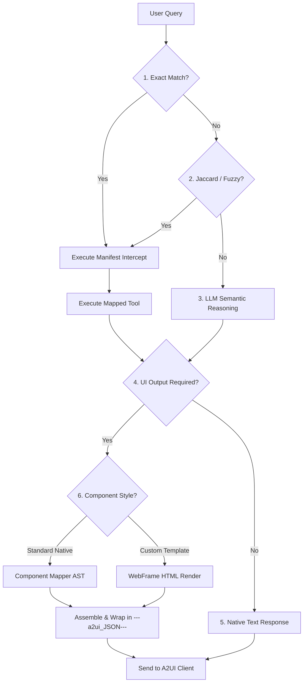

# Design & Implementation Plan: A2UI Seed Agent

This document outlines the strategic blueprint to establish this repository as a completely customer-agnostic, visually premium, and production-grade A2UI Seed Agent template (`a2ui_seed_agent`) that developers can clone to build custom, A2UI-enabled capability demos inside Gemini Enterprise.

---

## 1. Detailed Core Architectural Logic Flow

The A2UI Seed Agent follows a deterministic, multi-tiered execution pipeline to process user queries and formulate correct native text or A2UI visual payloads.



### A. Tier 1: Exact Match
*   The server cleans punctuation and normalizes both the input query and the manifest triggers list.
*   If an exact match is found against one of the `trigger_queries` in `demo_manifest.json`, the flow intercepts the query and executes the associated tool immediately.

### B. Tier 2: Jaccard & Fuzzy Semantic Match
*   If no exact match is found, and the step configuration has `"fuzzy_matching": true` enabled, the Jaccard keyword stem matching is performed.
*   It filters out common stop words (e.g., "let", "show", "give", "how", "many"), extracts keyword stems, and compares intersection counts. If the intersection exceeds the required threshold, the query is intercepted and handled deterministically.

### C. Tier 3: LLM Semantic Understanding (Gemini)
*   If no manifest triggers are matched (or if `"fuzzy_matching": false` is configured, forcing queries past Jaccard matching), the query flows semantically to Gemini.
*   The LLM reasons about the user's intent, parses the conversation context, and determines whether to call a custom backend tool, an ad-hoc standard UI rendering tool, or construct a dynamic response.

### D. Tier 4: UI Requirement & Format Decision
*   **No UI Required:** If the query is a simple conversational statement or clarification, the system emits a native text-only response.
*   **UI Required:** The system determines the format:
    *   **Standard Components:** Native A2UI elements (Tabs, Modals, TextFields, CheckBoxes, MultipleChoices, Sliders) constructed in Python via `component_mappers.py` and `component_library.py`.
    *   **Custom Viewports (WebFrames):** High-fidelity, dark-themed HTML viewport templates (`universal_dashboard.html`, `base_map.html`) rendered inside the WebFrame iframe via `WebFrameSrcdoc` or `WebFrameUrl`.
*   **Wrapping Delivery:** All structured visual payloads are perfectly schema-validated, transformed into JSON strings, and prepended by the delimiter `---a2ui_JSON---` on a new line to be natively parsed by the A2UI frontend harness.

---

## 2. Detailed Module Designs & File Modifications

### Step 1: Rebranding to A2UI Seed Agent
*   **File:** `/Users/rtejada/Workspace/a2ui-seed-agent/agent_card.json`
    *   Rename `"name"` to `"A2UI Seed Agent"`.
    *   Rename skills and tags to generic capabilities: `"Standard Components Showcase"`, `"Interactive Map Visualizations"`, `"Universal Metrics Dashboard"`, `"Voice Briefing & TTS Summary"`.
*   **File:** `/Users/rtejada/Workspace/a2ui-seed-agent/backend/main.py`
    *   Rebrand `agent_card` declaration properties (name to `"A2UI Seed Agent"`, tags to generic showcase parameters).
*   **File:** `/Users/rtejada/Workspace/a2ui-seed-agent/backend/agent.py`
    *   Rename the root agent identifier to `"a2ui_seed_agent"`.
    *   Update `SYSTEM_INSTRUCTION` to reflect a dark-mode generic capability seed agent.
*   **File:** `/Users/rtejada/Workspace/a2ui-seed-agent/backend/deploy.sh`
    *   Set `SERVICE_NAME` to `"a2ui-seed-agent"`.

### Step 2: Pre-Wired Standard Components Showcase
*   **File:** `/Users/rtejada/Workspace/a2ui-seed-agent/backend/data/showcase_widgets.json` (New File)
    *   Pre-wire mock datasets for a complete widgets dashboard including dropdown choices, checkbox items, range thresholds, and modal bodies.
*   **File:** `/Users/rtejada/Workspace/a2ui-seed-agent/backend/hr_data.py` (or generic `backend/showcase_data.py`)
    *   Create a tool `get_standard_widgets_overview()` that loads `showcase_widgets.json`.
    *   **CRITICAL (No silent fails):** If reading the file or internal loading fails, allow the exception to bubble up rather than mocking a dummy fallback dataset.
    *   Ensure all tool session data state is persisted to a local JSON file `/Users/rtejada/Workspace/a2ui-seed-agent/public/data/widget_state.json` inside a newly created `public/data/` directory.
*   **File:** `/Users/rtejada/Workspace/a2ui-seed-agent/backend/component_mappers.py`
    *   Create mapper `build_showcase_widgets_card(data)` returning A2UI 0.8 standard components:
        *   **`Tabs`**: Segment dashboards into Inputs, Choices, and Overlays.
        *   **`Modal`**: Popup triggers bound to native buttons.
        *   **`TextField` & `Slider`**: Inputs bound to reactive state paths (e.g., `"selections": {"path": "/tf_state"}`).
        *   **`CheckBox` & `MultipleChoice`**: dropdown and checkboxes wrapped in premium `Card` containers. Picklists MUST pass `"maxAllowedSelections": 1`, bind selections to `"path": "/dropdown_state"`, and specify option `value` equal to the text label.
        *   **"Load Last Run" Button**: Include a button that reads and re-populates active selections from the local state JSON.

### Step 3: High-Fidelity Maps (HTML Embed vs URL Embed)
*   **File:** `/Users/rtejada/Workspace/a2ui-seed-agent/backend/data/map_showcase.json` (New File)
    *   Store geographic mock coordinates, pulsing radar alert configurations, and polyline coordinates.
*   **File:** `/Users/rtejada/Workspace/a2ui-seed-agent/backend/agent.py`
    *   Create tool `get_map_visualization(route_type: str = "shortest_distance")`.
    *   **No Silent Fails:** Bubble up API or file access errors immediately if they fail.
    *   Determine the mapping strategy based on intent:
        1.  *Read-only queries:* Return a standard Google Maps static or directions URL (`WebFrameUrl`).
        2.  *Advanced queries:* Return decoupled coordinates from `map_showcase.json` rendered via `base_map.html` as `WebFrameSrcdoc`.
*   **File:** `/Users/rtejada/Workspace/a2ui-seed-agent/backend/templates/base_map.html`
    *   Full dark style system.
    *   Integrate pre-wired geographic details:
        *   **हॉटस्पॉट (Heatmaps)**: `L.heatLayer` density overlays.
        *   **Radar Pulsing Markers**: Pulsing rings (`.pulse-ring`) with dynamic colors (yellow, orange, red) indicating priority.
        *   **Animated dashed Polyline**: Dynamic route direction flows (`.animated-route`).
        *   **UI Toggles**: Dynamic map layers control to turn weather stubs and traffic lines on/off.

### Step 4: D3 network Graphs & Interactive Simulator Dashboard
*   **File:** `/Users/rtejada/Workspace/a2ui-seed-agent/backend/templates/universal_dashboard.html`
    *   Incorporate dynamic HTML components inside a single dark-themed grid panel:
        *   **KPI Summary Cards**: Bold metrics counters with caption descriptions.
        *   **Simulator Widgets**: Sliding controls recalculating data and layouts in real-time on input slide events.
        *   **Vega-Lite Charts**: Smoothly animated charts.
        *   **D3 Network Graph**: Fully interactive nodes and links displaying relationships complete with drag, zoom, and colored group boundaries.

### Step 5: Seekable Audio TTS & Multimodal Graphics
*   **File:** `/Users/rtejada/Workspace/a2ui-seed-agent/backend/media_tools.py`
    *   Ensure `generate_audio_summary` queries `gemini-3.1-flash-tts-preview` for a **150-word spoken briefing** (~45s).
    *   **PCM-to-WAV Transcoding:** Catch the raw `audio/l16` PCM bytes, calculate rate/channels, and prepend a standard **44-byte RIFF/WAV header** in Python. Save to the cache so browser HTML5 players can natively play and seek.
    *   **No Silent Fails:** Throw explicit errors if Vertex or TTS API pipelines fail.
    *   Support voice profiles from `demo_manifest.json` mapping:
        *   `"mode": "single"`: Single presenter voice profile.
        *   `"mode": "podcast"`: Two speaker voices conversation.
    *   Synthesize synthetic visuals using `gemini-3.1-flash-image-preview` cached to local directories or GCS.

### Step 6: Extensible Demo Manifest Configuration
*   **File:** `/Users/rtejada/Workspace/a2ui-seed-agent/backend/demo_manifest.json`
    *   Define 5 distinct phases showcasing widgets, map overlays, network dashboards, audio speech synthesis, and graphic generation.
    *   Set `"fuzzy_matching": true` on Phase 1-3 to loosely handle phrasing variations.
    *   Set `"fuzzy_matching": false` on Phase 4-5 to force queries directly to the LLM's semantic reasoning engine.
    *   *Note:* Standard ad-hoc component tools remain fully active in addition to manifest-driven phases to support freestyle user layouts.

---

## 3. Verification & Testing Plan (TDD)

*   **Test Suite:** `/Users/rtejada/Workspace/a2ui-seed-agent/backend/tests/test_schema_and_cors.py`
    *   Write detailed unit tests verifying:
        1.  **WAV Transcoding Validity**: Assert RIFF/WAV headers have the exact 44-byte footprint and correct PCM rates.
        2.  **Component Schema Validity**: Run `jsonschema` validation against standard component trees.
        3.  **HTTP CORS and Options Prefilters**: Validate Range serving headers for media.
    *   **Iteration:** Execute `python3 -m unittest discover -s tests` in the backend environment and iterate until all tests are green.

---

## 4. Google Cloud Identity & Secure Authentication Strategy (Service Accounts)

To completely prevent raw API key leaks or quota validation blocks (avoiding key invalidation risks like your peer encountered during a live demo), we transition all Google Cloud services from hardcoded credentials to a dedicated, least-privileged **Google Cloud Service Account** using Application Default Credentials (ADC).

### A. Provisioned Service Account Structure
We have provisioned a dedicated service account in `YOUR_GCP_PROJECT_ID` using the Google Cloud SDK:
*   **Service Account:** `a2ui-seed-run-identity@YOUR_GCP_PROJECT_ID.iam.gserviceaccount.com`
*   **Assigned Roles (Principle of Least Privilege):**
    1.  `roles/aiplatform.user` (Vertex AI User): Grants exact permissions required to execute multimodal text, audio (TTS), and graphic preview generation models on global Google Cloud endpoints.
    2.  `roles/storage.objectAdmin` (Storage Object Admin): Limits GCS write access exclusively to caching generated media assets inside the persistent `YOUR_GCP_PROJECT_ID-a2ui-media-cache` bucket.
 
### B. Local & Cloud Authentication Integration
*   **Cloud Run Instance Environment:** In `backend/deploy.sh`, we append the `--service-account` flag to the deployment instruction. The serverless environment automatically authenticates Vertex AI and GCS client requests securely using metadata-derived credentials:
    ```bash
    --service-account="a2ui-seed-run-identity@YOUR_GCP_PROJECT_ID.iam.gserviceaccount.com"
    ```
*   **Local Development Verification:** Developers do not distribute or check in physical `.json` key files. They securely authorize their local session using the Cloud SDK:
    ```bash
    gcloud auth application-default login
    ```
    The Python `google-genai` client will natively resolve these credentials when running tools locally.
*   *Note on Google Maps API Keys:* Because client-side Javascript maps embeds (`base_map.html` and `universal_dashboard.html` Google Map widgets) strictly require an API Key for browser script authorization, the `GOOGLE_MAPS_API_KEY` remains managed separately as an environment parameter and is never hardcoded inside frontend source code.

---

## 5. Security Verification (Mandatory)
*   **Path Safety:** Use strict `os.path.basename()` filters on all media dynamic path parameters.
*   **XSS Controls:** Enforce `textContent` assignments inside `universal_dashboard.html` and `base_map.html` JS loaders.
*   **Credential Protection:** Ensure no private JSON credentials or key files are checked into repository folders. Verify the `.gitignore` file blocks `.env` and key artifacts.

